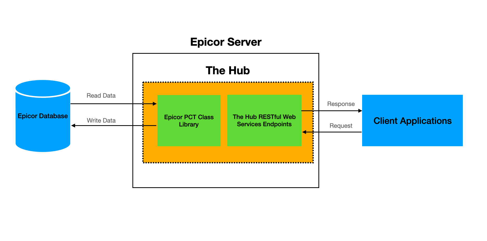

# TheHubASPNET
An ASP.NET web service to add order and get shipment details to the Epicor system.

# Architecture

# Implemented APIs
* POST /token - Get the token to access the APIs
* POST /api/order/add - Creates an order
* GET /api/order/shipment - Get shipment details 
* GET /api/order/status - Get the status of the order (Not yet implemented)

When you run the app, you can access the Swagger doc through this link:
http://<server.address>:<port>/swagger

# Things you need to know
* To access the APIs, you need to generate a token via  POST /token endpoint by specifying a valid username and password
* API endpoints can only be invoked successfully when then token is specified in the request header ("Authorization: Bearer <token>")
* User login info (username/password) is stored in a local SQLite database (App_Data/AspNetCoreWebApiJwt.db)

# To deploy the application in IIS Server
1. Download and install [.NET Framework 4.7 Web Installer](https://dotnet.microsoft.com/download/dotnet-framework/thank-you/net47-web-installer) on the server
2. Enable ASP.NET module in IIS
3. Copy the files from publish folder TheHubASPNET\TheHub\bin\Release\Publish to C:\inetpub\wwwroot\TheHubASPNET
4. Make sure that the C:\inetpub\wwwroot\TheHubASPNET folder has read, execute, and list folder permissions for IIS_IUSRS group
5. Add "TheHubASPNET" website in IIS and point the physical path to C:\inetpub\wwwroot\TheHubASPNET
6. Set TheHubASPNET Application Pool .NET CLR version to version v4.0x
